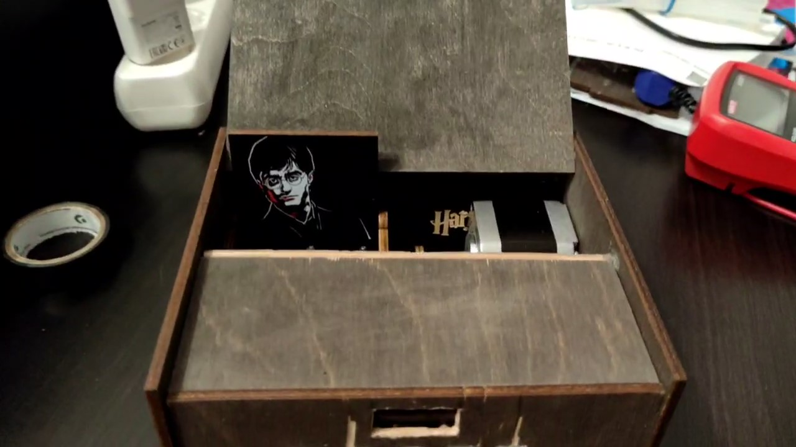
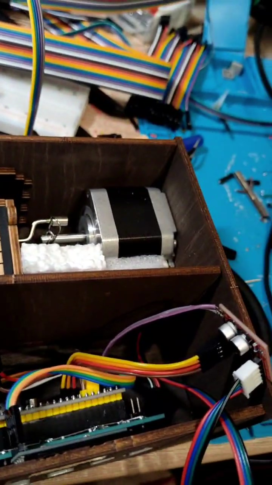
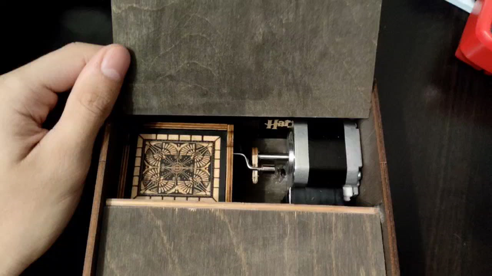
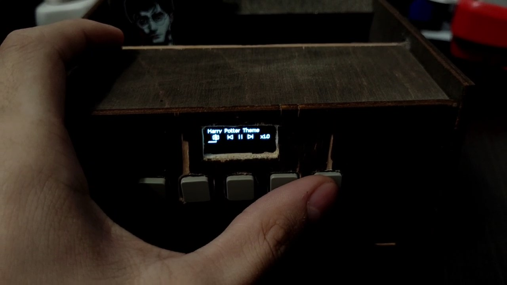
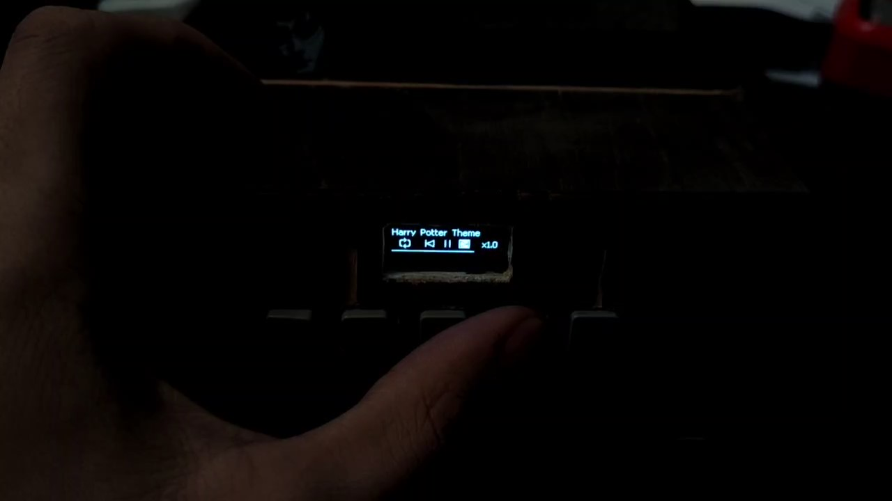

# Автоматическая музыкальная шкатулка

Электромеханическое устройство, которое приводит в действие обычный механизм музыкальной шкатулки с помощью шагового двигателя. Контроллер управляет воспроизведением, а OLED-дисплей и кнопки образуют интерфейс в стиле музыкального плеера.

*Внешний вид устройства: внутри общего корпуса размещены механическая шкатулка, привод и электроника управления.*

*Внутренняя компоновка во время сборки: шаговый двигатель, контроллер, драйвер и органы управления.*

*Шаговый двигатель вращает штатную рукоятку механической музыкальной шкатулки.*

*OLED-интерфейс отображает название композиции, режим повтора, кнопки управления, скорость и progress bar.*

*При нажатии физической кнопки соответствующий элемент интерфейса инвертируется на экране.*

## Видеодемонстрация

[▶ Смотреть видеодемонстрацию музыкальной шкатулки на Яндекс Диске](https://disk.yandex.ru/d/CQ4_7T7vlnKC_A)

## Что реализовано

- управление шаговым двигателем через готовый силовой драйвер;
- запуск и остановка воспроизведения;
- изменение скорости вращения;
- режим повтора и управление перемещением по композиции;
- расчёт текущей позиции по шагам двигателя;
- сохранение позиции во внутренней Flash-памяти и восстановление после включения;
- управление режимами полного, половинного и микрошагового движения в зависимости от скорости;
- кнопочный интерфейс с фильтрацией дребезга;
- графический интерфейс на OLED-дисплее 128×32: название композиции, кнопки плеера, скорость, повтор и progress bar.

## Архитектура

Проект построен на `STM32F103`. Генерация шагов привязана к аппаратному таймеру, управление двигателем выполняется независимо от периодического обновления интерфейса. Экран формируется в кадровом буфере и передаётся на OLED по I²C.

Основные каталоги:

- `Core/StepperMotor` — управление шаговым двигателем и режимами шага;
- `Core/Interface` — кнопки, OLED-дисплей и графический интерфейс;
- `Core/Src/music_box_main.c` — прикладная логика музыкальной шкатулки;
- `music_box_control.ioc` — конфигурация STM32CubeMX;
- `MDK-ARM/music_box_control.uvprojx` — проект Keil MDK.

## Технологии

`Embedded C` · `STM32F103` · `STM32 HAL` · `шаговый двигатель` · `PWM` · `таймеры` · `прерывания` · `I²C` · `OLED` · `Flash` · `Keil MDK` · `STM32CubeMX`
